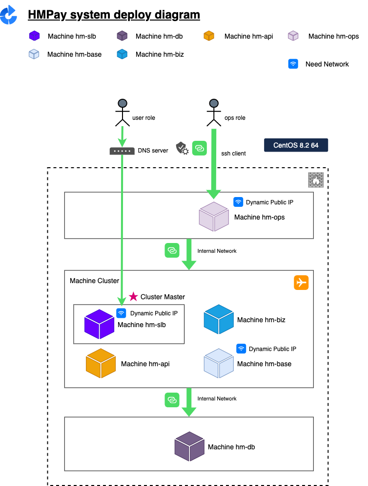
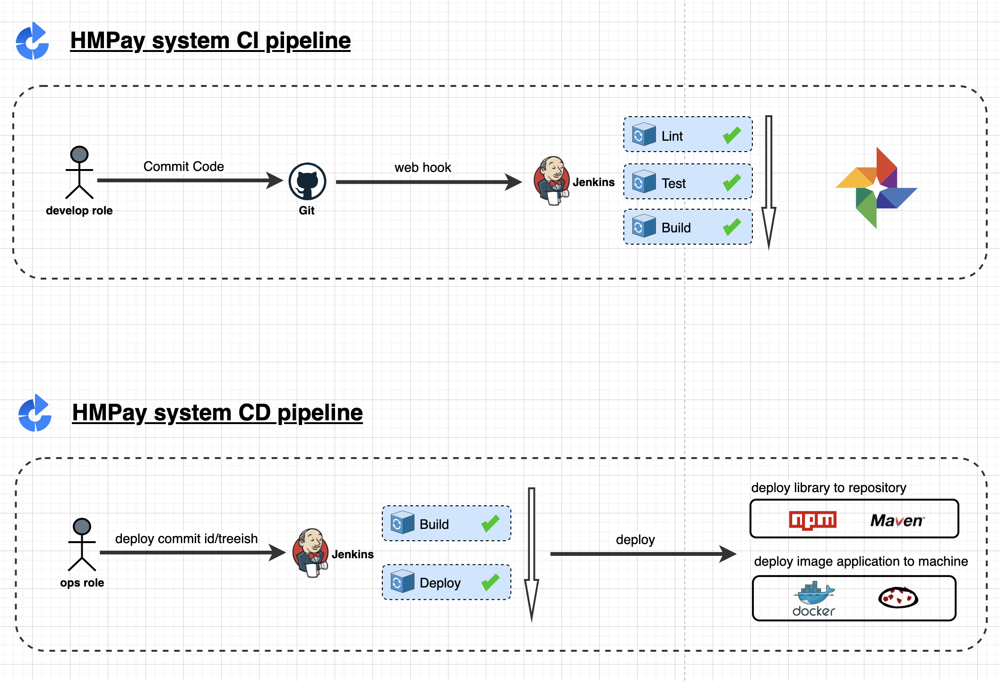
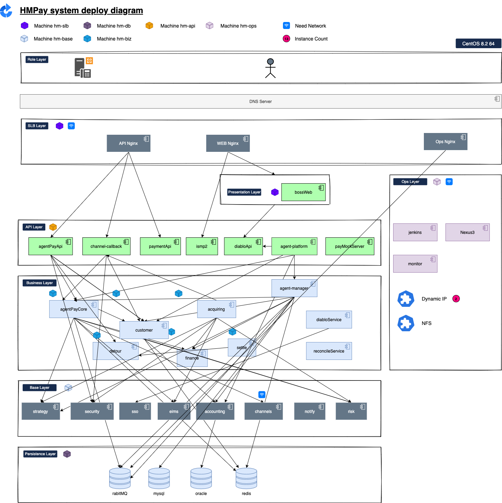

# devops

[](https://github.com/RichardLitt/standard-readme)

`devops` is a steps of how to archive the devops target for `hmpay` system.





## Table Of Content

- [devops](#devops)
  - [Table Of Content](#table-of-content)
  - [Background](#background)
  - [Common Commands](#common-commands)
  - [Steps for how to init machines](#steps-for-how-to-init-machines)

## Background

Here is a big, complex system. Below is the deploy detail diagram.



## Steps for how to init env for all machines

+ Execute [MachineInit.sh](./src/init/MachineInit.sh) for all machines(make sure the network is available) in aliyun batch console.

```sh
OPS_SSH_Public_key="ssh-rsa AAAAB3NzaC1yc2EAAAADAQABAAABAQC6iX7NnrGzXRS4tgeZlmAPCTEDXAO3FtaMSUGu7yuF4WFQXk6W6LSLDNx0/IHevkL5tP56qPVa4VGzTYv1AVF7Q8Q8nDPAph//VxduNx/oOQKzqOb5MhcX40nYrFIwWczk1PWnlChMdjdg1eJ1vFFvybcmVBhvxrBzA5tetGGnN63WMUQAxdgHVTXz0z8KVa3bhQqRK/58PtJbanYxv+SI0exMzb4sreTf/wMnpSKGcIiUwX9/lIlO3oIXMWkVn7mV+6MbjhzNk+mAK0ntMJ44FA7bNqAQDAMLaPuJxtBMksvHBj6t5EnoBEw12oq/cxc3iUMd7I2cKkeiVmtzBu5H" \
OPS_USER_NAME="huser" \
sh -c "$(curl -fsSL https://raw.githubusercontent.com/hmpay/mainchine-init-shell/main/MachineInit.sh)"
```


## Host Machine Expose Port Rules

**${Namespace(1)}${ServiceName(3)}${Channel(1)}**

+ Namespace: is a code for indicating an enviroment. range from[1-9].

eg.

> **9**xxxx: ops enviroment

> **5**xxxx: biz enviroment

+ ServiceName: is a code for a service(application). range from[001-999].

eg.

> 9**001**x: ops-jekins

> 9**002**x: ops-nginx

> 9**003**x: ops-nexus

+ Channel: is a code for a sub-application. range from[1-9].

eg.

> 9**003**1: ops-nexus-web

> 9**003**2: ops-nexus-docker-repository

### List if Ports

service-name      | port
---               | ---

> login to other machines that can ssh login from jumping machine.

#### Init the ssh config for `huser` user for jumping Machine1

```sh
echo "\
Host hm-slb
Hostname 172.19.182.202
User huser

Host hm-base
Hostname 172.19.182.203
User huser

Host hm-db
Hostname 172.19.182.204
User huser

Host hm-biz
Hostname 172.19.182.200
User huser

Host hm-api
Hostname 172.19.182.201
User huser" > /home/huser/.ssh/config
chmod 600 /home/huser/.ssh/config
```

### Login `huser` for all machine from jumping machine

```sh
# login to ops machine

# use pwd or add public key
ssh huser@139.196.165.125
ssh hm-slb
ssh hm-base
ssh hm-db
ssh hm-biz
ssh hm-api
```

### Init Docker Env for all machines


```sh
# goto hm-slb machine
docker swarm init
# run below commands.
docker swarm join --token SWMTKN-1-0ig31djibvuzn0ekq8fhxbatuzlfaklizk92eqxspio4v7kr2i-bzrs71ou4xli8yhdwka85924a 172.19.182.202:2377

# To add a manager to this swarm, run 'docker swarm join-token manager' and follow the instructions.
```

### Init Swarm Node for all machines

```sh
docker node update --label-add biz_layer=slb hm-slb
docker node update --label-add biz_layer=api hm-api
docker node update --label-add biz_layer=biz hm-biz
docker node update --label-add biz_layer=base hm-base
docker node update --label-add biz_layer=db hm-db
```

### Login Docker User for all machines

> we can also to execute this commands by aliyun batch-commands.

```sh
# private network
su huser
docker login -u alexhippo@163.com registry-vpc.cn-shanghai.aliyuncs.com -p hYdQ6mDmex8EjyaW
```

> this public network address is registry.cn-shanghai.aliyuncs.com
> you can add it for local development.
> docker login --username=alexhippo@163.com registry.cn-shanghai.aliyuncs.com -p xxxxx

> :pencil2: Exercise:
> @alex

### :book: Init Jenkins for `hm-ops` machine

```sh
# goto hm-ops

# pull the nexus3 image
docker pull jenkinszh/jenkins-zh:lts
# prepare for mount data dir
rm -rf jenkins-data

docker run -d --name jenkins -p 8082:8080 -p 5001:50000  --env JENKINS_SLAVE_AGENT_PORT=5001 -v /var/jenkins_home jenkinszh/jenkins-zh:lts

# enter container inner
docker exec -it  2280deb6025e sh

# cat the passwd for UI admin login
cat ~/jenkins-data/secrets/initialAdminPassword
```

> :pencil2: Exercise:
> @alex

## CD Pipeline

### how to build and push docker image to aliyun docker repository

```sh

# we can also use git commit-id as ver
docker build -t registry-vpc.cn-shanghai.aliyuncs.com/hmpay/oracle:${GIT_COMMIT::8} .

docker push registry-vpc.cn-shanghai.aliyuncs.com/hmpay/oracle:${GIT_COMMIT::8}

# deploy cluster

# for trade deploy
docker stack deploy -c /home/huser/devops/src/hmpay/production/docker-compose.yml stack-trade

# for ops deploy
docker stack deploy -c /home/huser/devops/src/ops/docker-compose.yml ops-stack
```

## Maintainers

[@alex.zhang](https://github.com/alex.zhang)

## Contributing

PRs accepted.

Small note: If editing the README, please conform to the [standard-readme](https://github.com/RichardLitt/standard-readme) specification.

## License

MIT © 2020 alex.zhang
