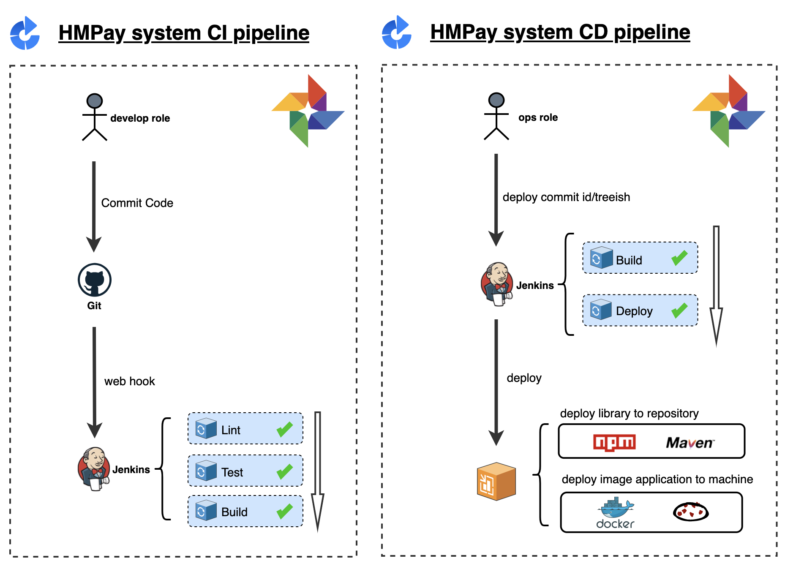

# devops

[](https://github.com/RichardLitt/standard-readme)

`devops` is a steps of how to archive the devops target for `hmpay` system.




## Table Of Content

- [devops](#devops)
  - [Table Of Content](#table-of-content)
  - [Background](#background)
  - [Common Commands](#common-commands)
  - [Steps for how to init machines](#steps-for-how-to-init-machines)

## Background

Here is a big, complex system. Below is the deploy detail diagram.


## Common Commands


```sh
# open the firewall service
systemctl start firewalld

# stop the firewall service
systemctl stop firewalld

# view the open port list
firewall-cmd --zone=public --list-ports

# restart docker server
systemctl restart docker
```

## Host Machine Expose Port Rules:

Here is the rule below:

```sh
${Namespace(1)}${ServiceName(3)}${Channel(1)}
```

+ Namespace: is a code for indicating an enviroment. range from[1-9].

eg.

> **9**xxxx: ops enviroment
> **5**xxxx: biz enviroment

+ ServiceName: is a code for a service(application). range from[001-999].

eg.
> 9**001**x: ops-jekins
> 9**002**x: ops-jekins
> 9**003**x: ops-nexus

+ Channel: is a code for a sub-application. range from[1-9].

eg.
> 9**003**1: ops-nexus-web
> 9**003**2: ops-nexus-docker-repository

## Steps for how to init machines

### Init SSH Login And User for jumping Machine


```sh
# login from from cloud console and execute.
cat "xxxxxxx" > /root/.ssh/authorized_keys

# generate ssh key for root user
ssh-keygen -t rsa

# add huser
useradd huser;groupadd huser
su huser
# generate ssh key for huser user
ssh-keygen -t rsa

cat "xxxxxxx" > /home/huser/.ssh/authorized_keys
```

> login to other machines that can ssh login from jumping machine.

#### Init the ssh config for `huser` user for jumping Machine1

```sh
echo "\
Host hm-slb
Hostname 172.19.182.202
User huser

Host hm-base
Hostname 172.19.182.203
User huser

Host hm-db
Hostname 172.19.182.204
User huser

Host hm-biz
Hostname 172.19.182.200
User huser

Host hm-api
Hostname 172.19.182.201
User huser" > /home/huser/.ssh/config
chmod 600 /home/huser/.ssh/config
```

### Init `huser` user for all machines

> add the huser from cloud console
```sh

rm -rf /root/.ssh/authorized_keys
echo "ssh-rsa AAAAB3NzaC1yc2EAAAADAQABAAABgQDv4961KtLBq9L2KY3VeB1U4Th8gOqHjvnpMJSV8SDyLDGTa5sYKp6ZDn3gVp4X7NUhI8zGZ7PE3CEIygi86jfa4S6Pwe4gQV7dE7KQWJ+j36Zw+rU1YoYIkHfGWfzOcWL1/TFkTdYaNxj+nAeUAEF1lRAD5jmv9hw7ZICDrUYQLYGY1l81ogyPUI9YM5STn3F+ZeqX9Foj5gqB2XfgLw1WIANT9A2yu8oGeD3nu5TZGIVafvZFA7f/wfmndtDlVW3nR+5Ebe71v8tqGHc3ZhNViElS0/1jTJpczCEW3XE5WOAwNBirV+1lKQ9ov1ktekDYPEEtID3TJjT1kD9mPzSqGRZC5Ikp3bDkBqMeZOOA3g63ckfWr7+6HEUxrvgs1kJygIc+GbFEgZtiTIVwyygLC9rCZFLbQbgK87sz7J1tTK6roPCP8d3RVAmKRo0tCkGzoFNRdS8PXRQnTdwEEA1U4ZNp/QV8X3zxVtgE87FMUp09lqdIGCanBZmUYL0i/us= root@iZuf6dcz9uks340jahtx57Z" > /root/.ssh/authorized_keys

useradd huser;groupadd huser
su huser
mkdir /home/huser/.ssh
rm -rf /home/huser/.ssh/authorized_keys
echo "ssh-rsa AAAAB3NzaC1yc2EAAAADAQABAAABgQDIOs9Y7Eb4BRwtx53zW2RLW9Hei+3lvi53p0vDMwKGuiBfsRfeuGrMqviiONLJy5t18ST0ghYwJpY4xUSXTERCaOK1oluhMC8a2XzBc4lPi18T1dZ9wapy4zTmwcKwnpuzty/qBzDghHOCctUGhGynQW9e0zVlkJ0tqupGBKdcFrnAtQdvRkDEfy9D/PAyAlFmxtVUXgX3Af6p4LZv4aoZcncjh3KyYe7cewrCTSWbchgyqDg5Kh5oKMPhfUCjyjR3LneubGpWquWUMgUI4069QwsbfvigeTro65W7ZY/4ETyJJ2YM6v9RTlcg9+iIppuOiViDOKGIFDw4H8cHTtvt097ADqv7dnWL5uZsCGEKcT/uA37tZx7uT6i8U5p8qS91Gov6F6+f3xMkTD4mOsJxjIkfrK5YCQWC/Cxhk9xfTi9hkki85Sxa8V5RiCbhHoU8vGIbVD+MY1ZAoF+7YfBT9zG4N5cOIuWMxSAor5UxB1Q1MYTdjC1jRpT6WpgjdaM= huser@iZuf6dcz9uks340jahtx57Z" > /home/huser/.ssh/authorized_keys

chmod 600 /home/huser/.ssh/authorized_keys

add `huser` to sudoers file
```

```sh
vi /etc/sudoers

# below root    ALL=(ALL)       ALL
huser   ALL=(ALL)       ALL

# set the machine hostname
hostnamectl set-hostname xxx
```

### Login `huser` for all machine from jumping machine

```sh
# login to ops machine

# use pwd or add public key
ssh huser@139.196.165.125
ssh hm-slb
ssh hm-base
ssh hm-db
ssh hm-biz
ssh hm-api
```

### Init Docker Env for all machines

```sh
sudo yum remove docker \
                  docker-client \
                  docker-client-latest \
                  docker-common \
                  docker-latest \
                  docker-latest-logrotate \
                  docker-logrotate \
                  docker-engine

sudo yum install -y yum-utils
sudo yum-config-manager --add-repo https://download.docker.com/linux/centos/docker-ce.repo
sudo yum install -y docker-ce docker-ce-cli containerd.io
sudo systemctl start docker

# add huser to docker group
sudo gpasswd -a huser docker
newgrp docker
docker run hello-world
```

```sh
# goto hm-slb machine
docker swarm init
# run below commands.
docker swarm join --token SWMTKN-1-0ig31djibvuzn0ekq8fhxbatuzlfaklizk92eqxspio4v7kr2i-bzrs71ou4xli8yhdwka85924a 172.19.182.202:2377

# To add a manager to this swarm, run 'docker swarm join-token manager' and follow the instructions.
```

### :book: Init Nexus3 for `hm-ops` machine

```sh
# goto hm-ops

# pull the nexus3 image
docker pull sonatype/nexus3
# prepare for mount data dir
rm -rf ~/nexus-data

docker run -d -p 8081:8081 --name nexus3 -v ~/nexus-data --restart=always sonatype/nexus3

# enter container inner
docker exec -it  4e6a7bd6289d /bin/sh

# cat the passwd for UI login
cat ~/nexus-data/admin.password
```

> :pencil2: Exercise:
> @alex

### :book: Init Jenkins for `hm-ops` machine

```sh
# goto hm-ops

# pull the nexus3 image
docker pull jenkinszh/jenkins-zh:lts
# prepare for mount data dir
rm -rf jenkins-data

docker run -d --name jenkins -p 8082:8080 -p 5001:50000  --env JENKINS_SLAVE_AGENT_PORT=5001 -v ~/jenkins-data:/var/jenkins_home jenkinszh/jenkins-zh:lts

# enter container inner
docker exec -it  2280deb6025e sh

# cat the passwd for UI admin login
cat ~/jenkins-data/secrets/initialAdminPassword
```

> :pencil2: Exercise:
> @alex

## Maintainers

[@alex.zhang](https://github.com/alex.zhang)

## Contributing

PRs accepted.

Small note: If editing the README, please conform to the [standard-readme](https://github.com/RichardLitt/standard-readme) specification.

## License

MIT © 2020 alex.zhang
